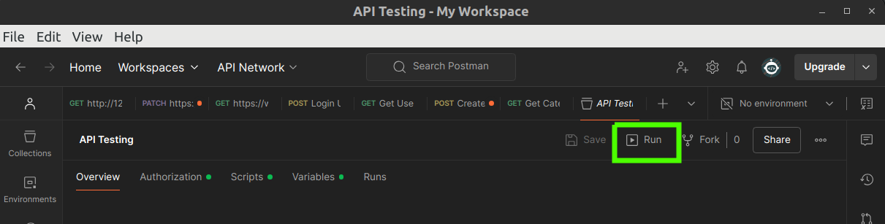

# Event Management Application

## Features

### Event Management
- Users can create, update, and delete events.
- Events can be recurring or one-time, with customizable recurrence rules.

### Notification System (Not Completely Implemented)
- Notifications can be enabled or disabled for individual events and based on user settings.
- Notifications automatically created for notifiable events
- Notifications can be sent via email, SMS, or push notification. (Future)
- Notification content is customizable based on notifiable model. It can be Event, Basket, etc. (Future)

### Celery Integration (Future)
- The app is designed with future integration of Celery in mind. Celery will manage and schedule the sending of notifications efficiently, especially for large volumes of events.

## TODO
- Add tests for each app
- Complete the notification system
- Add Celery integration for managing notifications

## Installation (Docker Compose)

1. Clone the repository
2. Run `docker-compose up --build`
3. Server will be running at `http://localhost:8000`

## Testing with postman collection
1. Import the postman collection from `API Testing.postman_collection.json`
2. Open the collection and `Run` the requests 

3. You can also http://localhost:8000/api/schema/swagger-ui/ check the API documentation